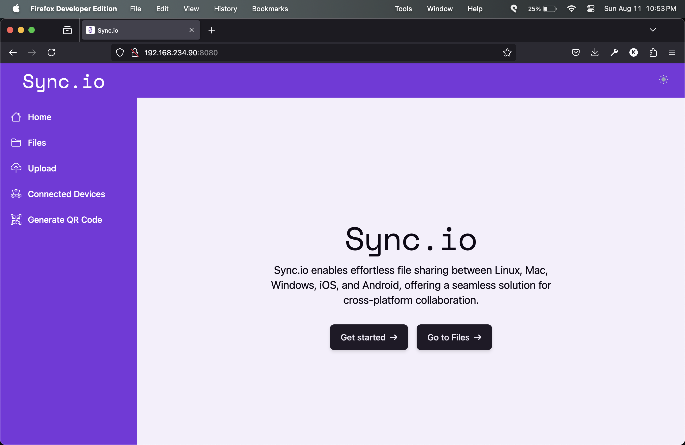
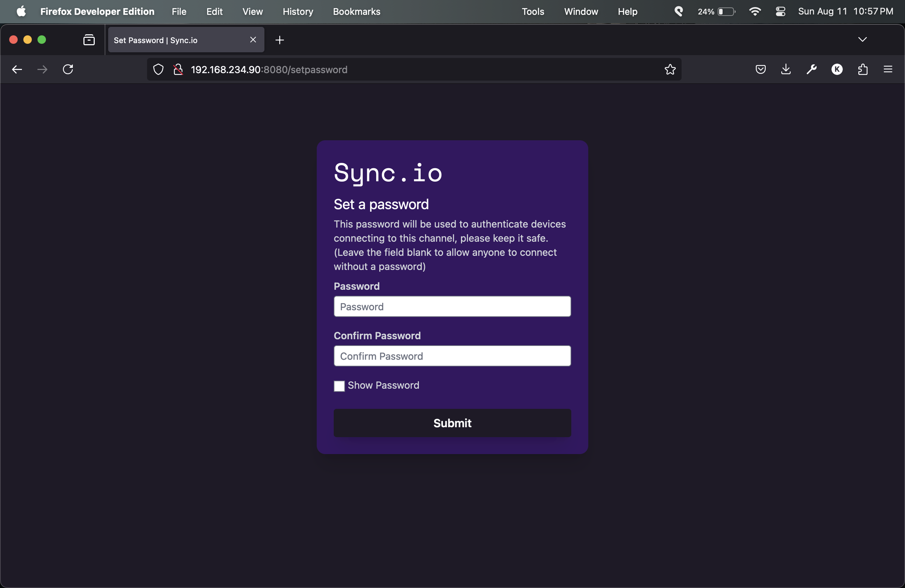
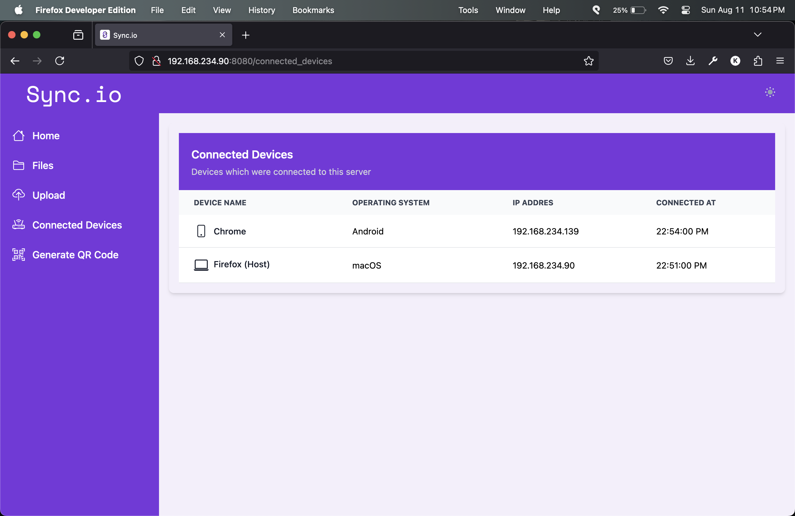
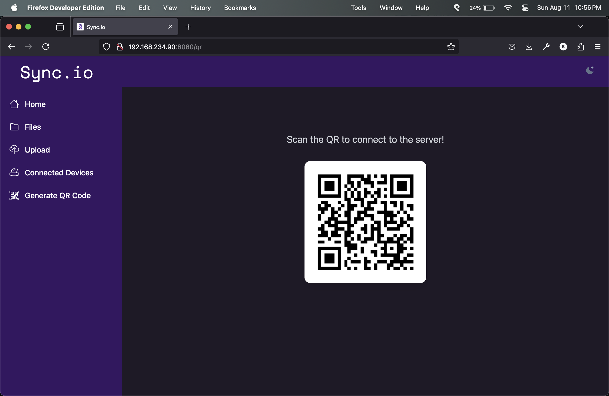
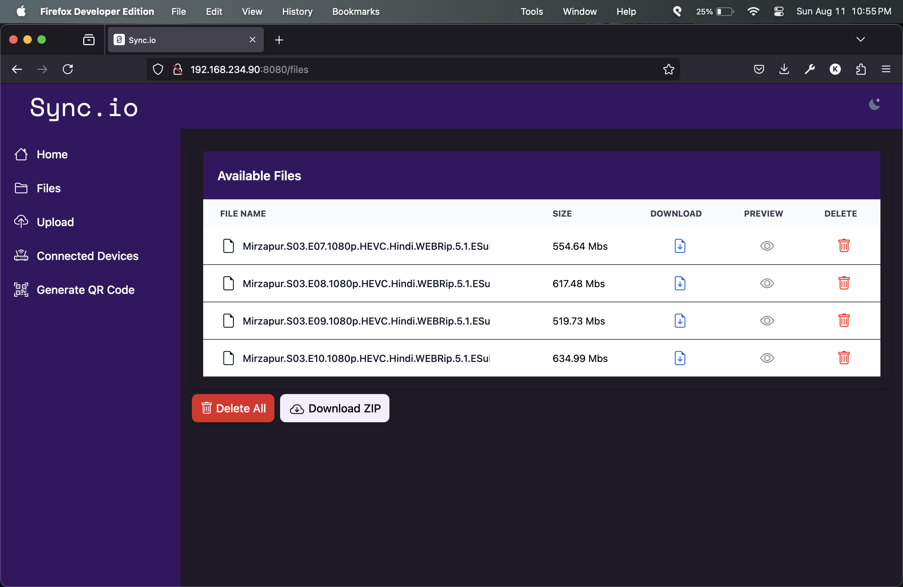

<div align="center" id="top"> 
  

  &#xa0;

</div>

<h1 align="center">Sync.io</h1>

<p align="center">
  

  

  

  

  

  

  

  
</p>


<p align="center">
  <a href="#dart-about">About</a> &#xa0; | &#xa0; 
  <a href="#sparkles-features">Features</a> &#xa0; | &#xa0;
  <a href="#rocket-technologies">Technologies</a> &#xa0; | &#xa0;
  <a href="#question-how-to-use">How to use</a> &#xa0; | &#xa0;
  <a href="#arrow_down-downloads">Download</a> &#xa0; | &#xa0;
  <a href="#white_check_mark-requirements">Requirements</a> &#xa0; | &#xa0;
  <a href="#checkered_flag-starting">Starting</a> &#xa0; | &#xa0;
  <a href="#fireworks-screenshots">Screenshots</a> &#xa0; | &#xa0;
  <a href="#memo-license">License</a> &#xa0; | &#xa0;
  <a href="https://github.com/KhushalJangid" target="_blank">Author</a>
</p>

<br>

## :dart: About ##

A simple and easy to use HTTP based file sharing server to aid platform 
independent wireless file sharing between multiple devices

## :sparkles: Features ##

:heavy_check_mark: Supports Windows/Linux/Mac OS as Host  
:heavy_check_mark: No limit on concurrent device connections\
:heavy_check_mark: High speed file transmission using HTTP/1.1 protocol\
:heavy_check_mark: Easily connect devices through QR code

## :rocket: Technologies ##

The following tools were used in this project:

- [Golang](https://go.dev/)
- [HTML](https://developer.mozilla.org/en-US/docs/Web/HTML)
- [Bootstrap](https://getbootstrap.com/)
## :question: How to use ##

Follow these steps to run the prebuilt executables:

1. Download the Executable binary for your device 
2. Connect all the devices to the same network (Hotspot also works)
3. Run the file by clicking it or run ```./Sync.io-...``` in terminal in the download directory.\
&#xa0;&#xa0;3.1. In case of permission denied or crashing, run the program with `sudo` or Administrator priviledges
4. Visit the Url displayed in terminal after running the program using `Cmd`+click or `Ctrl`+click
5. Generate and Scan QR code to connect multiple devices, alternatively type in the Url from previous step in a browser

## :arrow_down: Downloads ##

The executable binaries are available for:

- MacOS (Intel)
- MacOS (Apple Silicon)
- Linux (amd64/x86_64)
- Linux (arm64)
- Windows (amd64/x86_64)
- Windows (arm64)

[Download From Releases](https://github.com/KhushalJangid/sync.io/releases)
<!-- 
- [MacOS (intel)](build/Sync.io-darwin-amd64)
- [MacOS (Apple silicone)](build/Sync.io-darwin-arm64)
- [Linux (amd64)](build/Sync.io-linux-amd64)
- [Linux (arm64)](build/Sync.io-linux-arm64)
- [Windows (amd64)](build/Sync.io-windows-amd64.exe)
- [Windows (amd64)](build/Sync.io-windows-arm64.exe) -->

## :white_check_mark: Requirements ##

Before starting, you need to have [Git](https://git-scm.com) and [Golang](https://nodejs.org/en/) installed to clone and build the Project.

## :checkered_flag: Starting ##

```bash
# Clone this project
$ git clone https://github.com/KhushalJangid/sync.io

# Access
$ cd sync.io

# Install dependencies
$ go get .

# Run the project
$ go run main.go

# Build for all supported platforms
$ chown +x build.bash
$ ./build.bash 

# Build for your platform
$ go build .
```

## :fireworks: Screenshots ##






## :memo: License ##

This project is under license from MIT. For more details, see the [LICENSE](LICENSE) file.


Made with :heart: by <a href="https://github.com/KhushalJangid" target="_blank">Khushal Jangid</a>

&#xa0;

<a href="#top">Back to top</a>
